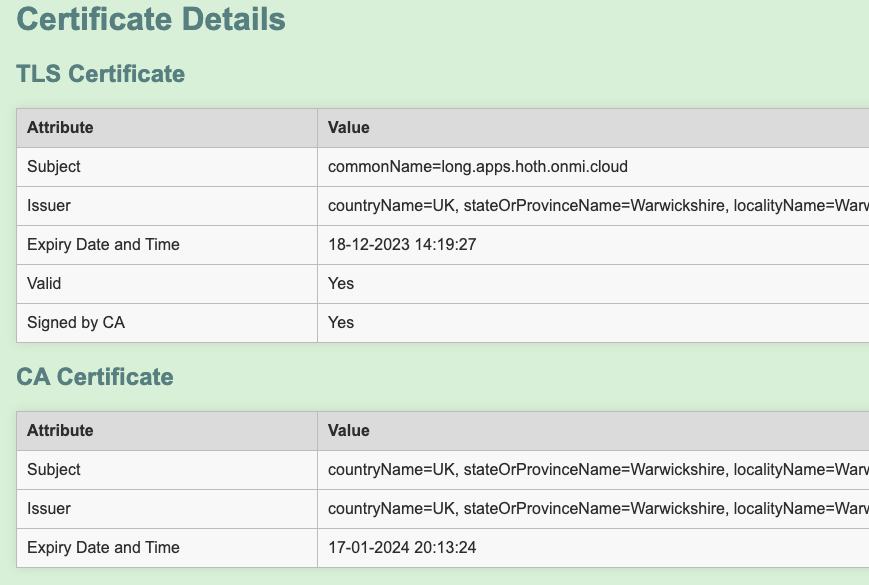

# flask-cert-details

Small utility to demonstrate the validity / rotation of certificates. Particularly helpful for demonstrating HashiCorp Vault's PKI Secrets Engine in Kubernetes clusters.

## usage

Set the following environment variables:

* TLS_CERT_PATH - Filesystem path to certificate file
* CA_CERT_PATH - Filesystem path to issuing CA file

Run the application:

```bash
$ python3 app.py
 * Serving Flask app 'app'
 * Debug mode: on
WARNING: This is a development server. Do not use it in a production deployment. Use a production WSGI server instead.
 * Running on http://0.0.0.0:5000
Press CTRL+C to quit
 * Restarting with stat
 * Debugger is active!
```

## output

Access either via FQDN, or via the URL in the CLI.

